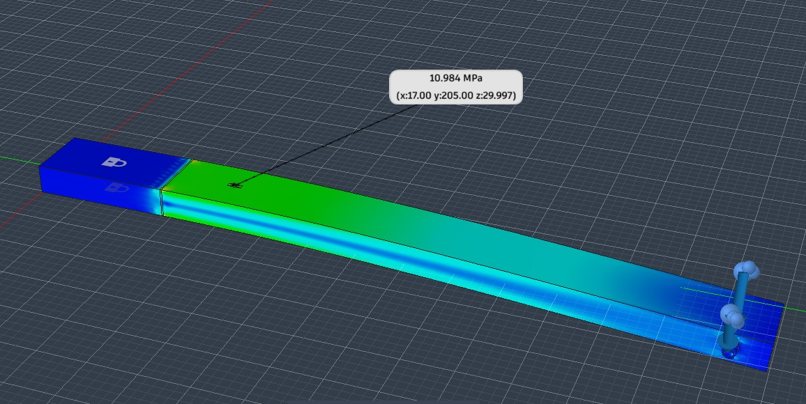
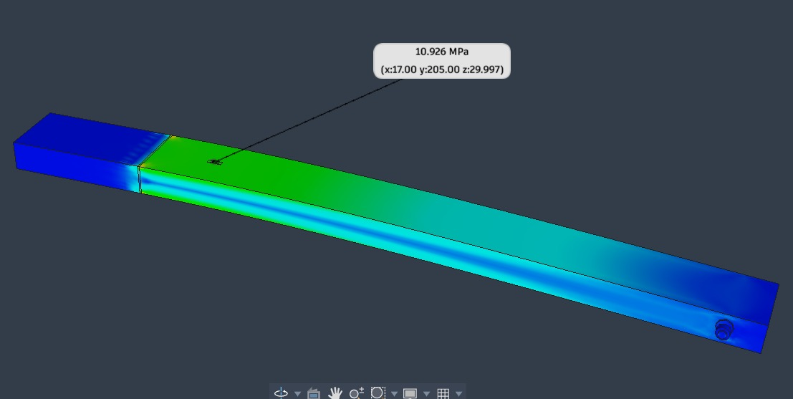

# Estudio de malla

Las mallas de **10 y 15 mm** se actualizaron con los informes y capturas exportados el 30 de septiembre de 2026. Los HTML se conservan completos y las capturas mantienen su formato PNG original. Las imágenes anteriores de esas dos mallas se sustituyeron; Git conserva sus versiones previas.

| Malla | Informe de Fusion | Captura | Nodos | Elementos | Von Mises máximo global (MPa) | Von Mises en el punto (MPa) |
|---:|---|---|---:|---:|---:|---:|
| 10 mm | [10mm.html](10mm.html) | [10mm.png](10mm.png) | 80 346 | 40 572 | 21,018 | 10,984 |
| 15 mm | [15 mm.html](15%20mm.html) | [15mm.png](15mm.png) | 48 735 | 24 301 | 20,722 | 10,926 |

Los recuentos y máximos globales proceden de los HTML. Las lecturas puntuales proceden de las etiquetas de las capturas; el autor confirmó que el resultado seleccionado era **Von Mises**. Ambas etiquetas indican (x, y, z) = (17,000; 205,000; 29,997) mm.

La diferencia puntual es 0,058 MPa: **0,5280 %** respecto a la malla de 10 mm. Estos dos resultados muestran baja sensibilidad local al refinamiento, pero todavía no acreditan convergencia definitiva ni equivalencia con la deformación longitudinal medida por la galga. No se ejecutó una nueva simulación para esta actualización.

Ambos HTML exportan dos fuerzas remotas de 24,883 N, con componente Z de −23,382 N por lado, posición remota y = 707 mm y gravedad de 9,807 m/s². El modelo analizado figura como `VIGA_FEM v25` en 10 mm y `VIGA_FEM v26` en 15 mm. Aún debe comprobarse la correspondencia de esta configuración con la carga y el estado de referencia del ensayo.

## Captura de la malla de 10 mm

## Captura de la malla de 15 mm

Los archivos de las mallas de 5, 20 y 25 mm corresponden a las exportaciones anteriores.
